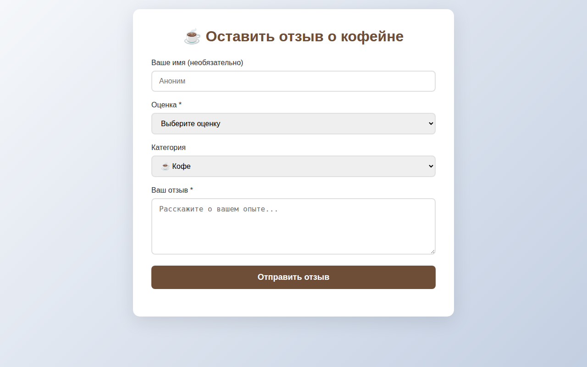
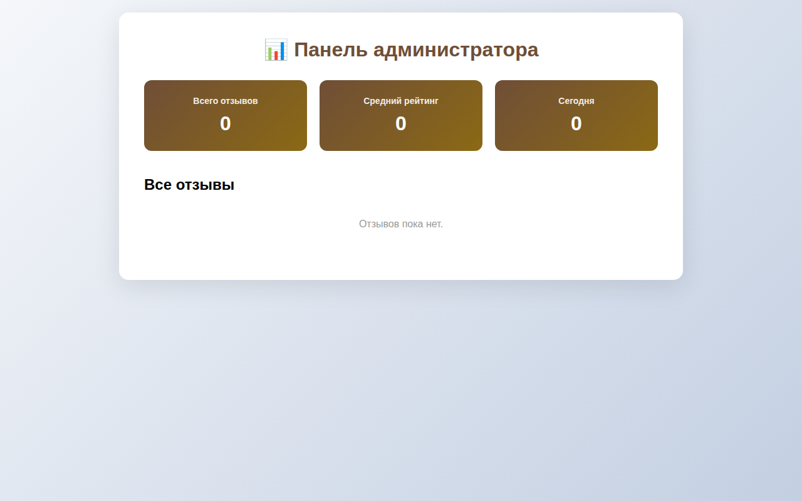

# Coffee Shop Feedback Board

*Anonymous feedback collection for coffee shops with web interface and Telegram bot*

## Demo

### Feedback Form


### Admin Dashboard


## Product Context

**End users:** Coffee shop visitors (leave feedback) and owners (receive notifications)

**Problem:** Visitors hesitate to give feedback in person; owners miss valuable insights

**Solution:** Anonymous web form + Telegram bot notifications + admin dashboard

## Features

### Implemented
- Anonymous feedback form with rating and categories
- PostgreSQL database storage
- Admin dashboard to view all feedback
- Telegram bot with instant notifications
- Statistics commands: /stats, /list

### Not yet implemented
- QR codes for tables
- Reply to feedback

## Usage

**For visitors:** Open the web form, fill in rating, category, and message, then submit.

**For owners:** 
- View all feedback at /admin.html
- Receive Telegram notifications instantly
- Use /stats and /list commands in Telegram

## Deployment

**Requirements:** Ubuntu 24.04, Docker, Docker Compose

**Steps:**
```bash
git clone <your-repo-url>
cd se-toolkit-hackathon
cp .env.example .env.docker.secret
# Edit .env.docker.secret with your BOT_TOKEN and ADMIN_CHAT_ID
docker compose up --build -d
```

## License

MIT
